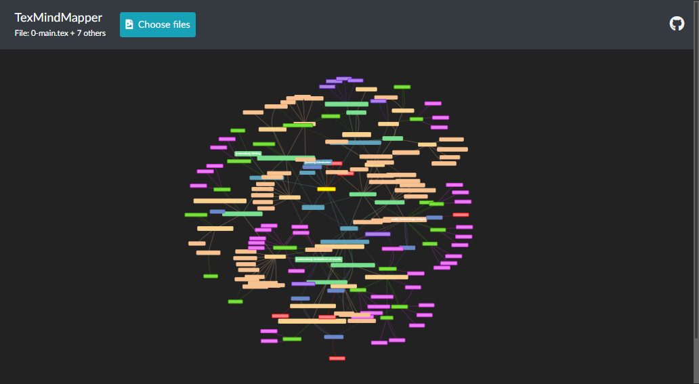

# TexMindMapper
Create mind maps from LaTeX files

## Origin
Writing a report, thesis, article or similar can get a bit overwhelming. I wanted to have an easy way to visualise what I was actually scribbling.

## Description
The program iterates the LaTeX file and parses a tree out of it. Uses [`pytextree`](https://github.com/PebbleBonk/pytextree) for it. Displays the analysed LaTeX project as a graph with sections and environments as nodes. The solid edges portray the chil-parent relations of the sections and envirinoments, and dashed edges the references between entities.

Built with [`flask`](https://flask.palletsprojects.com/en/1.1.x/) and [`vis.js`](https://visjs.org/)

## Features
1. Loading a LaTeX project containing multiple files (supports `\include{}`)
    - All the files included have to be uploaded, otherwise their content will be ignored
2. Relative sizing of nodes based on the number of words found in them
3. Edges between the nodes based on the references
4. Node colouring based on the type of the node

